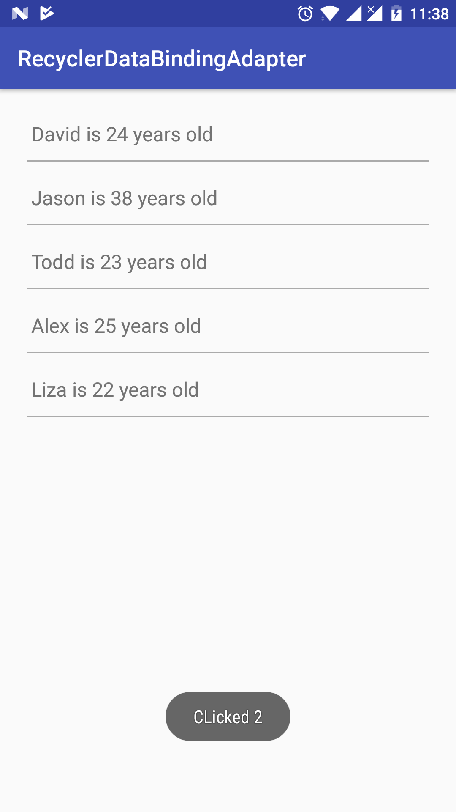

# RecyclerDataBindingAdapter

This is a simple wrapper around `RecyclerView.Adapter` that i use instead of defining my own implementation each time i use `RecyclerView`. 

### Usage is rather simple
```java
RecyclerDataBindingAdapter<RowViewModel> adapter =  new RecyclerDataBindingAdapter<>(R.layout.row_main, BR.rowData, this);
mBinding.rvHome.setAdapter(adapter);
```
It uses Android Data Binding to bind item with view. Item click is also embeded and click event can be received on the variable passed in constructor.
```java
//Click appears here
    @Override
    public void onItemClick(int pos, RowViewModel rowViewModel) {
        Toast.makeText(MainActivity.this, "CLicked " + pos, Toast.LENGTH_SHORT).show();
    }
```



### Dependency:
```gradle
compile 'com.github.ankitgusai:RecyclerDataBindingAdapter:1.4'
```
